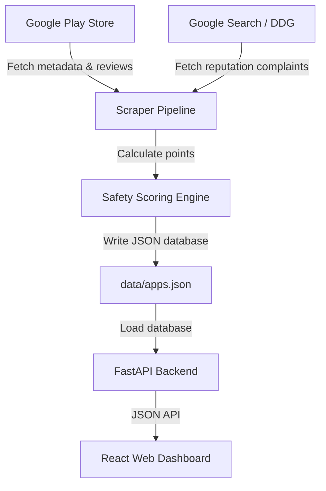

# Loan App Safety Checker

This is a simple research tool and dashboard designed to check if a loan app is safe to use or if it has red flags (like aggressive collectors, hidden fees, or weird permissions). 

The scraper script gathers details from the Google Play Store, downloads reviews, checks app permissions, searches the web for complaints, and gives each app a safety score between 0 and 100.

### How Data Flows in the System


---

> [!IMPORTANT]
> **Disclaimer:** This tool evaluates safety based on publicly available reviews and web searches. It does not provide legal advice or definitive declarations of an app's legality.

---

## How the Web Scraper Works

To get a full picture of each app's reputation, the script does focused web searches for every app it checks.

### 1. The Search Queries
For each app, the script searches for:
* `"<App Name>" loan scam`
* `"<App Name>" loan harassment`

It then looks at the search results and categorizes the sources based on their website address (e.g., classifying them as news articles, forum posts like Reddit, government warnings, or consumer complaints).

### 2. Bypassing Search Engine Blocks
Standard search engines hate automated scripts and will block your IP address very quickly. To get around this, the scraper uses a two-tier approach:
* **The Main Method (Google Search via Serper):** If you sign up at `serper.dev` (which gives you 2,500 queries for free) and put your API key in the `.env` file, the script will use the Serper API. This is fast, highly reliable, and gives you real Google search citations instantly.
* **The Fallback Method (DuckDuckGo HTML):** If you don't have an API key, the script scrapes the text-only version of DuckDuckGo (`html.duckduckgo.com`) using Python's `requests` and `BeautifulSoup`. It uses random browser headers to avoid getting flagged as a bot. If it gets temporarily rate-limited, it waits (cools down) for 6 seconds and retries.

---

## How the Safety Score is Calculated

The safety score starts at **0** (safest) and increases up to **100** (most dangerous) based on what the scraper finds:

* **Abusive Behavior (+25 points):** If user reviews mention collectors threatening them, harassing their family, or calling their contact list.
* **Contact Abuse (+25 points):** Flagged if the app requests permission to read your contacts and reviews complain that collectors are spamming their friends.
* **Hidden Fees (+15 points):** Flagged if users complain about high processing fees or short 7-day repayment periods.
* **Fraud/Scam (+25 points):** Flagged if users or news reports say the app takes money without disbursing loans.
* **Unclear Developer (+15 points):** Flagged if the developer website is missing or if they use a free support email (like `@gmail.com`).
* **Review Manipulation (+5 points):** Flagged if the app has a spike of suspicious, identical, or short repetitive 5-star reviews.

*Note: Safe apps get a small discount (up to 12 points off) if they have a real company website, a corporate email address, and no review manipulation.*

---

## How to Run the Project

### Step 1: Install Python dependencies
Create a virtual environment and install the required packages:
```bash
/opt/homebrew/bin/python3.12 -m venv .venv
source .venv/bin/activate
pip install -r requirements.txt
```

### Step 2: Configure your environment
Create a file named `.env` in the root folder and add your Serper API key:
```ini
SERPER_API_KEY=your_key_here
PORT=8000
VITE_API_URL=http://localhost:8000
```

### Step 3: Run the scraper pipeline
This script searches for loan apps on Google Play, downloads their details and reviews, runs web searches, and saves the final result to `data/apps.json`:
```bash
PYTHONPATH=. python scraper/run_all.py --count 25
```
*(It automatically caches store pages and reviews on disk so you don't make duplicate requests on subsequent runs).*

### Step 4: Run the FastAPI backend
```bash
source .venv/bin/activate
uvicorn backend.main:app --reload --port 8000
```

### Step 5: Start the React frontend
Open a new terminal tab, install frontend packages, and run the development server:
```bash
cd frontend
npm install
npm run dev
```
Open the link shown in your terminal (usually `http://localhost:5173`) to view the dashboard!

---

## Project Code Files

* **`scraper/playstore.py`**: Fetches app info from the Play Store.
* **`scraper/reviews.py`**: Downloads up to 100 user reviews per app.
* **`scraper/permissions.py`**: Checks if the app asks for sensitive permissions.
* **`scraper/web_research.py`**: Queries Serper/DuckDuckGo for reputation sources.
* **`scraper/review_analysis.py`**: Scans review comments for keywords.
* **`scraper/risk_scoring.py`**: Implements the 0–100 scoring logic.
* **`scraper/run_all.py`**: Runs all the scraper modules together.
* **`backend/main.py`**: Exposes search/filter endpoints for the frontend.
* **`frontend/src/App.jsx`**: The dashboard interface.

---

## Methodology Limitations & Review Volume Analysis

### Why do we fetch exactly 100 reviews?
For this safety checker, downloading exactly **100 reviews per app** is the best balance:
* **Good statistical signals:** If a loan app has major complaints (like collectors spamming contact lists), you will easily spot multiple reports even in a sample of 100 reviews.
* **Polite scraping:** Google Play blocks scripts that download thousands of reviews in one go. Fetching 100 reviews is fast and avoids triggering rate limits.
* **Responsive interface:** 100 reviews per app keeps the database file (`data/apps.json`) small (around 1.8MB). This lets the dashboard load and filter instantly in your browser.

### How this would scale in a production environment:
If you want to turn this into a large-scale safety directory:
1. **Continuous checks:** Instead of running the script once, you would set up a background worker to fetch new reviews regularly (e.g. weekly) to catch any behavior changes after app updates.
2. **True database:** You would move the data from `data/apps.json` into a proper database (like MongoDB or PostgreSQL) for better search indexing.
3. **Larger sampling size:** You would increase the review download limits to 1,000+ reviews per app to capture long-term safety trends.
